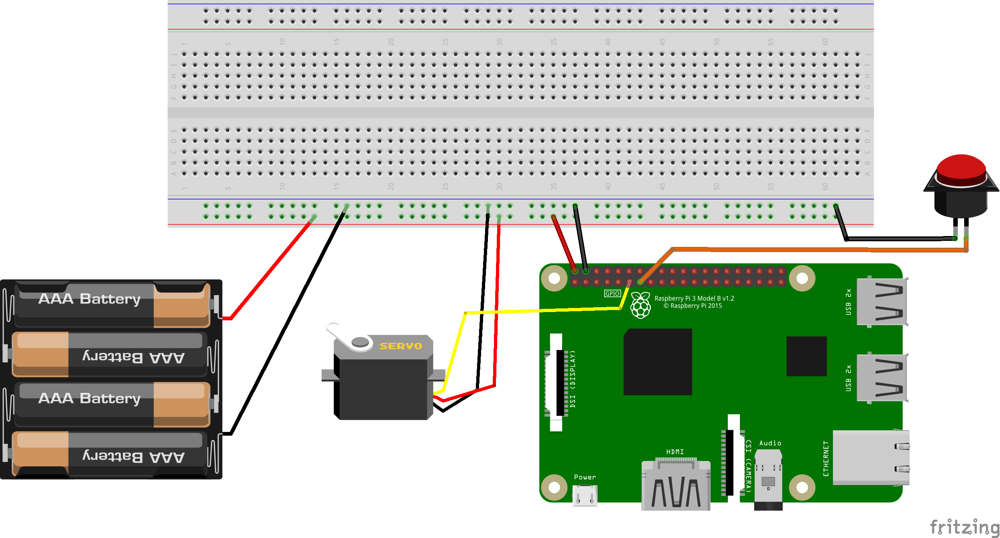

# catfeeder

Operates a cat feeder made with a cereal dispenser, servo and Raspberry Pi3. Food is dispensed with a pushbutton on the feeder or a webpage. It uses a python app to control the servo since existing python libraries for GPIO support are pretty solid. (Sorry, Go would have been preferable but too many GPIO shenanigans).

Parts List:

* [Cereal Dispenser](https://www.amazon.com/gp/product/B0009MGQUC/ref=oh_aui_detailpage_o06_s00?ie=UTF8&psc=1)
* [SM-S4303R Continuous Rotation Servo](https://www.amazon.com/gp/product/B00X7BPI1K/ref=oh_aui_detailpage_o01_s01?ie=UTF8&psc=1)
* [Raspberry Pi 3](https://www.amazon.com/Raspberry-Pi-896-8660-Model-Motherboard/dp/B01CD5VC92/ref=sr_1_1?s=pc&ie=UTF8&qid=1483931167&sr=1-1&keywords=raspberry+pi3)
* [TTL Console Cable](https://www.adafruit.com/product/954)
* [USB power supply](https://www.amazon.com/gp/product/B00OY7HR1U/ref=oh_aui_detailpage_o03_s00?ie=UTF8&psc=1)

Fritzing Diagram



## Raspberry PI Setup

### Install Linux

All steps performed from OSX.

1. [Download raspbian lite](https://downloads.raspberrypi.org/raspbian_lite_latest), do a fast xfer using unbuffered disk (rdisk) to copy it super fast:
    ```
    sudo bash -c 'dd if=/Users/USERNAME/Downloads/2016-11-25-raspbian-jessie-lite.img | pv | dd of=/dev/rdisk# bs=1m'
    ```

2. Update SD card, add to bottom `/boot/config.txt` to disable bluetooth and allow use of debug TTL cable.
    ```
    dtoverlay=pi3-disable-bt
    systemctl disable hciuart
    ```

3. Login with screen ([need TTL cable drivers](https://learn.adafruit.com/adafruits-raspberry-pi-lesson-5-using-a-console-cable/software-installation-mac))
    ```
    sudo screen /dev/cu.usbserial 115200
    ```

    The user / pass is `pi` / `raspberry`

4. Enable wifi
    ```
    sudo nano /etc/wpa_supplicant/wpa_supplicant.conf
    ```
    Go to the bottom of the file and add the following:

    ```
    network={
        ssid="The_SSID"
        psk="Your_wifi_password"
    }
    ```

    Then reboot the Pi.

5. Add mDNS Support
    ```
    sudo apt-get install avahi-daemon
    echo "catfeeder" | sudo tee /etc/hostname
    ```

    Then reboot the Pi.

Now the Pi should respond to [catfeeder.local](http://catfeeder.local)

### Software Setup

On the Raspberry Pi, perform RPi.GPIO installation. Install packages:

```
sudo apt-get update
sudo apt-get -y install python-rpi.gpio python3-rpi.gpio python-dev
```

Make sure we have PIP..

```
curl https://bootstrap.pypa.io/get-pip.py | sudo python
```

Install python packages

```
sudo pip install RPi.GPIO
sudo pip install Flask
```

## Running the Cat Feeder

You will need to tune the number of ms in `FEEDER_PORTION_TIME_MS` to reflect correct portion size for your needs.

Run the app, viewable on http://catfeeder.local

```
sudo python catfeeder.py
```

To run on startup, copy `catfeeder` into `/etc/init.d`, then run:

```
sudo update-rc.d catfeeder defaults
```
